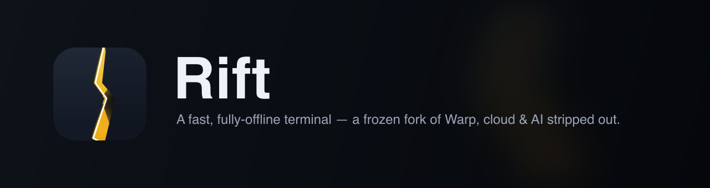
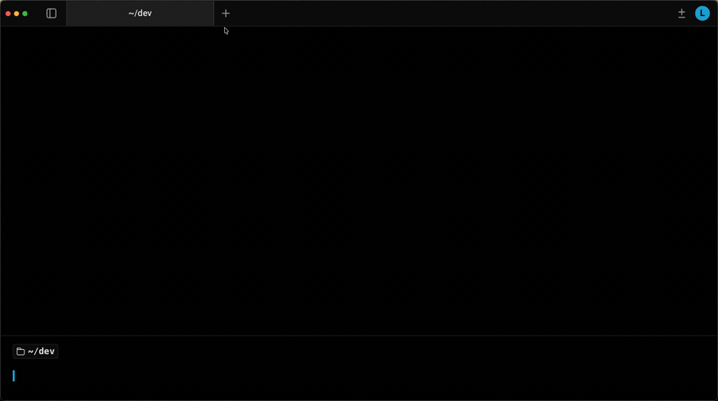

<p align="center">
  
</p>

<p align="center">
  
</p>

**Rift** is a personal, frozen, fully-offline fork of [Warp](https://www.warp.dev) — the terminal kept, everything cloud and AI stripped out.

It is the Warp terminal you compile yourself: blocks, GPU rendering, and editor-style command input, with no account, no network calls, and no agent. Not a product — a terminal I own and can modify.

## Download

Grab the latest `.dmg` from the [**Releases**](../../releases/latest) page, open it, and drag **Rift** to Applications.

**Apple Silicon only** (M1 or newer) — Intel Macs are not supported.

The build isn't notarized yet, so clear the quarantine flag once after installing:

```sh
xattr -dr com.apple.quarantine /Applications/Rift.app
```

(or right-click the app → **Open** the first time). Or [build it yourself](#building).

## How Rift differs from Warp

| | Warp | Rift |
|---|---|---|
| Account / login | Required for most features | **None** — no auth, can't be login-walled or rate-limited |
| Telemetry | Live Rudderstack key, UGC events | **Removed** — zero phone-home, defense by absence not a flag |
| AI agents | Core of the product | **Removed entirely** — no agent, no MCP, no inline AI |
| Cloud / Drive / teams | Load-bearing, woven throughout | **Removed** — fully offline, single local user |
| Billing / credits | Compiled in (`buy credits` banner) | **Removed** — frozen, runs forever, no business model attached |
| Auto-update | On | **Removed** — pinned to the version you build |

**Kept:** the blocks UI, wgpu GPU rendering, the editor-style command prompt, themes, vertical tabs, and non-AI autosuggestion (fish-style history + rule-based corrections).

## What was stripped

Measured against `warpdotdev/warp` (the `upstream` remote):

- **~703,000 lines of Rust removed** — roughly **half** the Rust codebase (1.39M → 691K lines)
- **~1,500 source files** deleted
- **20 crates** removed (71 → 51) — the entire `ai`, cloud-object, server, auth, GraphQL, and firebase layers

The point isn't a smaller binary. It's that the telemetry, cloud, and billing code *doesn't exist* in the tree — it can't be switched back on.

## Building

Default binary is `rift-oss`. The toolchain pins via `rust-toolchain.toml`; `protoc` is required (`brew install protobuf`).

```bash
./script/bootstrap   # platform-specific setup
./script/run         # build and run Rift
./script/presubmit   # fmt, clippy, and tests
```

See [RIFT.md](RIFT.md) for the full engineering guide — coding style, testing, and platform notes.

## Relationship to upstream

Rift tracks `warpdotdev/warp` as the `upstream` remote and pulls changes manually via cherry-pick — no dependency on anyone porting them first. The whole codebase is renamed `warp` → `rift`, so it diverges from upstream by design; that's the trade for owning the fork outright.

## Licensing

Inherited from Warp. The UI framework crates (`riftui_core` and `riftui`) are under the [MIT license](LICENSE-MIT); the rest of the repository is under the [AGPL v3](LICENSE-AGPL).

## Open Source Dependencies

A few of the open-source projects Rift (and Warp before it) is built on:

- [Tokio](https://github.com/tokio-rs/tokio)
- [NuShell](https://github.com/nushell/nushell)
- [Fig Completion Specs](https://github.com/withfig/autocomplete)
- [Alacritty](https://github.com/alacritty/alacritty)
- [FontKit](https://github.com/servo/font-kit)
- [Core-foundation](https://github.com/servo/core-foundation-rs)
- [Smol](https://github.com/smol-rs/smol)
